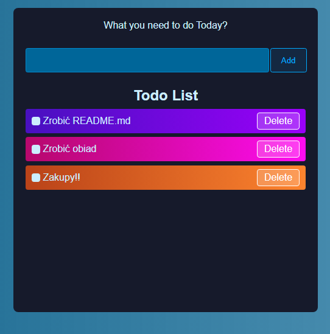

# Simple ToDo List application

This is a very basic "TodoList" application, thanks to which you can add tasks that you have to do, mark them done, and delete them.



## How to use it?

First of all you need to download or clone the repository and then install the dependencies via:

```bash
npm i
```
or 

```bash
npm install
```
Then launch the application via:

```bash
npm run dev
```

and click the localhost link displayed in the terminal.
